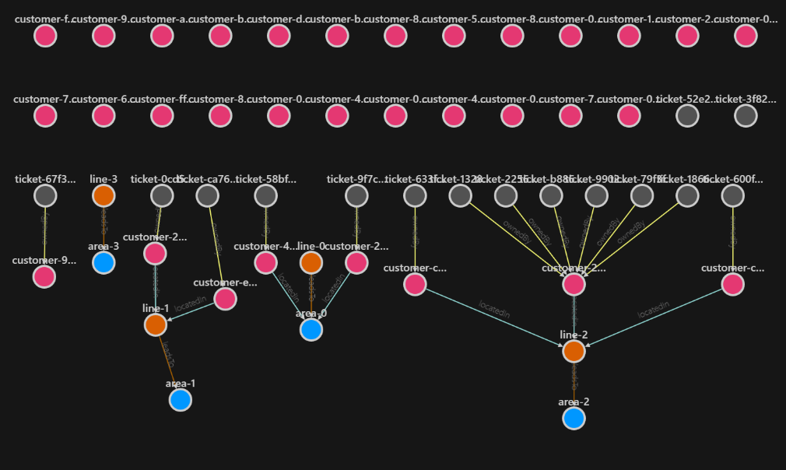

## Digital Twin Tutorial

These notebooks will show you how to create a graph and interact with it through the Python API. It will build a venue and allow you to measure the customer satisfaction of people as the pass through the system. This is the most basic model that has
* customers - who have a customer satisfaction score
* tickets - that are purchased by people who enter the system
* lines (that people wait in) 
* areas (where people are)

**Note** that most of these items aren't from IoT sensors. In this scenario lines and areas have IoT sensors that send telemtry to the cloud. Those sensors are conected via a digital model to the information that we care about such as tickets and people. This shows you how the _model integrates your IoT devices with your digital ecosystem_

You will need: 
* A conda environment with the latest `Azure-Digital-Twin SDK`
* The Azure CLI tools for authentication
* The digital twin explorer
* A digital twin account (duh), where you have sufficient permission. 

The perspective of these notebooks is from the role of the **Analyst** not an application. The purpose is to use the graph to glean insights on customers. This would allow you to query the API in real time, as events are happening. 

| notebook | purpose |
|----------|:-------------:|
| 01 |  The basics of connecting, uploading models and creating twins |
| 02 |  More details about creating relationships, updating values and basic queries |
| 03 |  Some examples of arbitrary model changes that I made to shape the model |
| 04 |  More detail about running queries with some examples of how to get insights |

